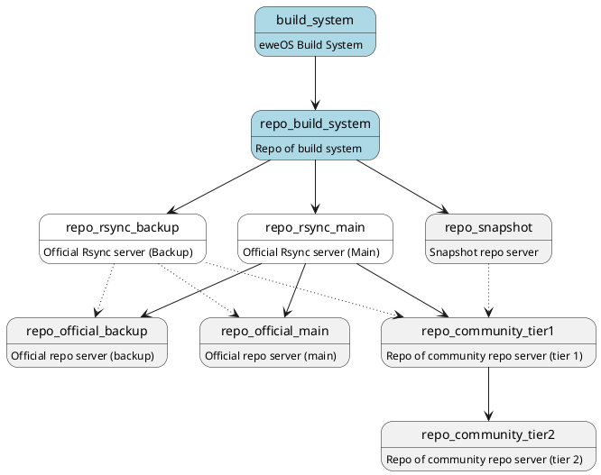

# Repositories

## `main` repo

Location: `/eweos/main`
Managed by: `PackageManagers`

This repository provides packages maintained by developers of eweOS team and ready for users.

## `testing` repo

Location: `/eweos/testing`
Managed by: `PackageManagers`

This repository provides unstable/transitional packages in testing stage. Default `pacman.conf` disables this repository and should only enable for developers.

## `eur` repo

Location: `/eweos/eur`
Managed by: `Members`

This repository is maintained by users in eweOS community and only provides `PKGBUILD` with source files instead of binaries to avoid potential legal issues.

## device/platform specific repos

Location: `<TODO>`
Managed by: `PackageManagers`

These repositories is maintained by developers of eweOS team to provide device/platform-specific packages and/or customized packages optimized for specific devices/platforms.

## ports repos

Location: `/eweos-ports/<arch>/{main,testing}`
Managed by: `PortManagers`

These repositories should not be regarded as parts of eweOS repositories since extra architectures are not officially supported by eweOS. However, eweOS allows users to apply for submitting extra architectures maintained by themselves and request eweOS official repo servers to serve these repositories.

# Repo Servers

## Sync Workflow

## Rsync Server

## Official Repo Server

## Community Repo Server

### Community Tier 1 Repo Server

### Community Tier 2 Repo Server

## Snapshot Repo Server