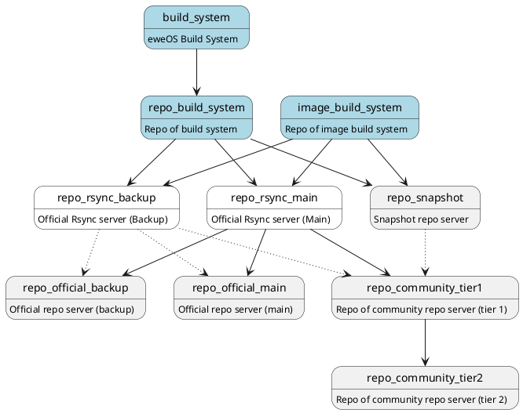

# Repositories

## `main` repo

Location: `/eweos/main`
Managed by: `PackageManagers`

This repository provides packages maintained by developers of eweOS team and ready for users.

## `testing` repo

Location: `/eweos/testing`
Managed by: `PackageManagers`

This repository provides unstable/transitional packages in testing stage. Default `pacman.conf` disables this repository and should only enable for developers.

## `eur` repo

Location: `/eweos/eur`
Managed by: `Members`

This repository is maintained by users in eweOS community and only provides `PKGBUILD` with source files instead of binaries to avoid potential legal issues.

## ports repos

Location: `/eweos-ports/<arch>/{main,testing}`
Managed by: `PortManagers`

These repositories should not be regarded as parts of eweOS repositories since extra architectures are not officially supported by eweOS. However, eweOS allows users to apply for submitting extra architectures maintained by themselves and request eweOS official repo servers to serve these repositories.

### device/platform specific repos

Location: `/eweos-ports/platforms/<platform>/<arch>`
Managed by: `PackageManagers`

These repositories is maintained by developers of eweOS team to provide device/platform-specific packages and/or customized packages optimized for specific devices/platforms.

# Repo Servers

## Sync Workflow

## Rsync Server

> rsync servers are currently WIP
{.is-warning}

> rsync server for eweOS is currently only available for official servers and community tier-1 servers.
{.is-info}

- Main Rsync Server: `os-repo-rsync.ewe.moe`
- Backup Rsync Server: `os-repo-rsync-bak.ewe.moe`

rsync policy:
- every 15min, rsync servers would check repositories of build system and sync the contents of each repo.

## Official Repo Server

- Main Repo Server: `os-repo.ewe.moe`
- Backup Repo Server: `os-repo-bak.ewe.moe`

These servers do not provide rsync service and would be placed at the bottom of the pacman mirrorlist to recommend local mirrors.

## Community Repo Server

The list of community repo servers can be found at [here](https://os.ewe.moe/download).

### Community Tier 1 Repo Server

A community tier-1 repo server must:

- provides rsync to downstream tier-2 repo servers
- have at least 100Mbps (upload) network connection
- have available and responsive person of contact (PoC)
- sync at least `main` and `testing` repo from official rsync server
- have 100GB free disk space remained after a full sync
- provide services for all users and downstream community repo servers without exception policies

### Community Tier 2 Repo Server

A community tier-2 repo server must:

- sync at least one architecture of `main` repo

## Snapshot Repo Server

This server provides daily incremental snapshots for eweOS `main` repo.

Snapshot policy:

- a incremental snapshot of current `main` repository is taken at 00:00 CST everyday except the first day of each month.
  - a full snapshot of current `main` repository is taken at 00:00 CST every first day of each month.
  - the incremental snapshot would be based on the full snapshot
- snapshots older than 12 months would be deleted

## Repo Selector

> repo selector is currently WIP
{.is-warning}

Repo selectors do not provide contents of repositories but redirections for optimized servers based on IP address and/or other rules based on users' requests.

## DN42 Access

eweOS provides official repositories in DN42 and also serves community repo servers in DN42.

> Currently we are considering serving eweOS contents in a standalone domain. This is currently WIP.
{.is-warning}

### Rsync Server (DN42)

### Official Repo Server (DN42)

- Main Repo Server: `repo.nia.dn42`

## Setup a eweOS mirror

See [Setup a eweOS mirror](/dev/topic/infra/repos/setup-mirror)