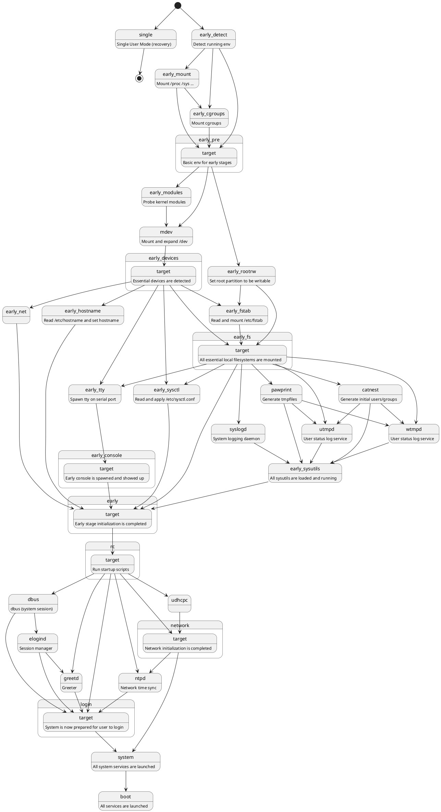

# bootflow

```plantuml
@startuml

single: Single User Mode (recovery)
early_detect: Detect running env
early_mount: Mount /proc /sys ...
early_cgroups: Mount cgroups
early_pre.target: Basic env for early stages
mdev: Mount and expand /dev
early_modules: Probe kernel modules
early_devices.target: Essential devices are detected
early_rootrw: Set root partition to be writable
early_fs.target: All essential local filesystems are mounted
early_fstab: Read and mount /etc/fstab
early_hostname: Read /etc/hostname and set hostname
early_tty: Spawn tty on serial port
early_sysctl: Read and apply /etc/sysctl.conf
pawprint: Generate tmpfiles
catnest: Generate initial users/groups
utmpd: User status log service
wtmpd: User status log service
early_sysutils: All sysutils are loaded and running
syslogd: System logging daemon
early_console.target: Early console is spawned and showed up
early.target: Early stage initialization is completed
rc.target: Run startup scripts
network.target: Network initialization is completed
dbus: dbus (system session)
elogind: Session manager
ntpd: Network time sync
greetd: Greeter
login.target: System is now prepared for user to login
system: All system services are launched
boot: All services are launched


[*] --> single
single --> [*]
[*] --> early_detect
early_detect --> early_mount
early_mount --> early_cgroups
early_detect --> early_cgroups
early_detect --> early_pre.target
early_mount --> early_pre.target
early_cgroups --> early_pre.target
early_pre.target --> early_rootrw
early_pre.target --> early_modules
mdev --> early_devices.target
early_pre.target --> mdev
early_modules --> mdev
early_devices.target --> early_hostname
early_devices.target --> early_net
early_devices.target --> early_fstab
early_rootrw --> early_fstab
early_rootrw --> early_fs.target
early_fstab --> early_fs.target
early_devices.target --> early_fs.target
early_fs.target --> syslogd
early_fs.target --> pawprint
early_fs.target --> early_sysctl
early_devices.target --> early_sysctl
early_fs.target --> early_tty
early_devices.target --> early_tty
early_tty --> early_console.target
early_fs.target --> catnest
early_fs.target --> utmpd
early_fs.target --> wtmpd
catnest --> utmpd
catnest --> wtmpd
pawprint --> utmpd
pawprint --> wtmpd
catnest --> early_sysutils
pawprint --> early_sysutils
syslogd --> early_sysutils
utmpd --> early_sysutils
wtmpd --> early_sysutils
early_console.target --> early.target
early_net --> early.target
early_hostname --> early.target
early_sysutils --> early.target
early_fs.target --> early.target
early_sysctl --> early.target
early.target --> rc.target
rc.target --> network.target
rc.target --> login.target
rc.target --> udhcpc
udhcpc --> network.target
rc.target --> ntpd
network.target --> ntpd
ntpd --> login.target
network.target --> system
login.target --> system
system --> boot
rc.target --> dbus
dbus --> login.target
dbus --> elogind
elogind --> login.target
rc.target --> greetd
elogind --> greetd
greetd --> login.target

@enduml
```

# System Services

## Early Services

## Ordinary Services

# User Services
